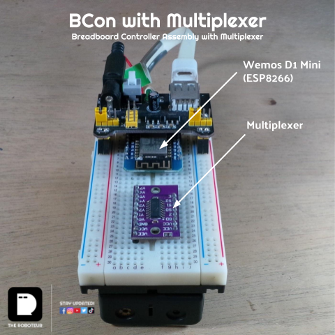
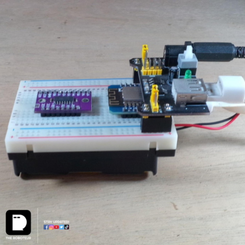

# THE BCON | Breadboard Controller Assembly 
* A breadboard controller assembly for quick robotics or IoT prototyping.
* You can find this setup among our previous and future builds. 
## BCon without Mux
### Construction
## BCon with Mux
### Construction

### Code
Multiplexer code is here: 
