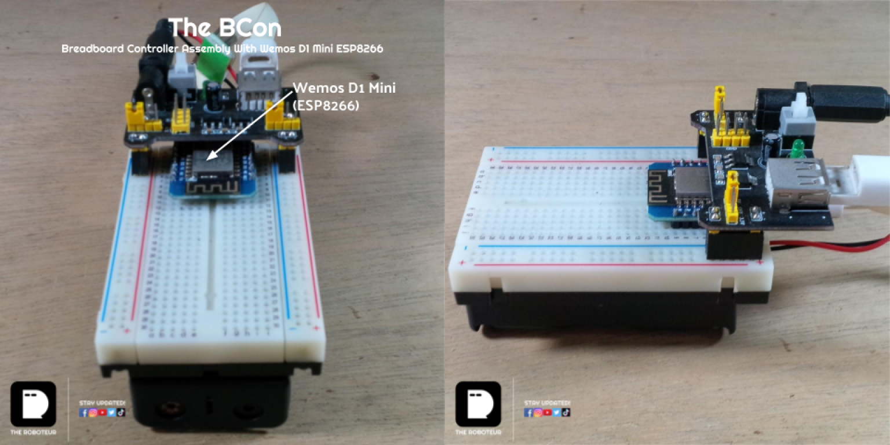
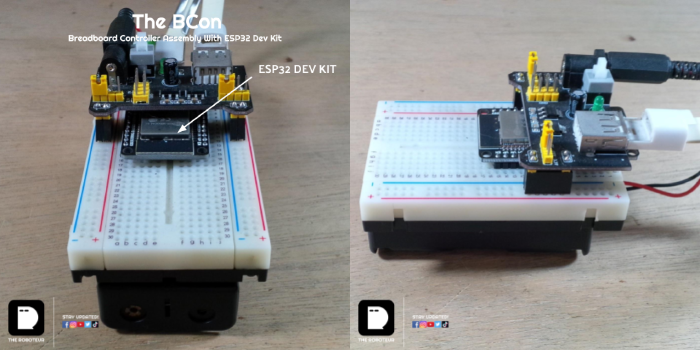
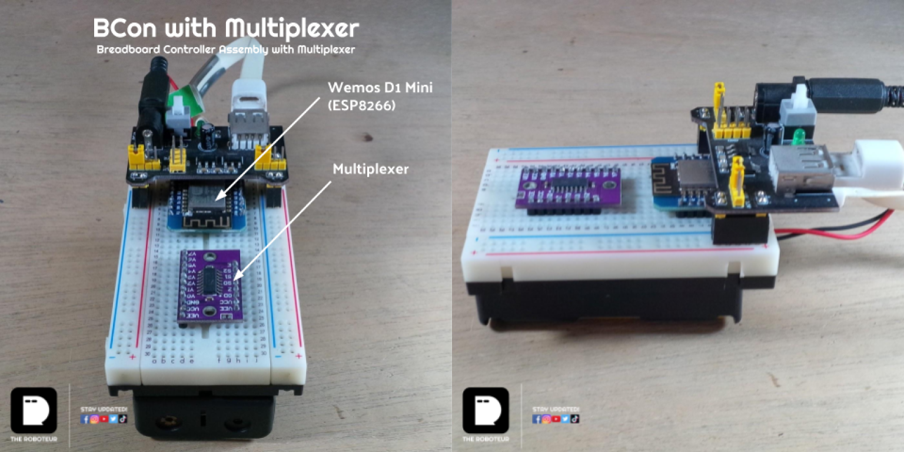

# THE BCON | Breadboard Controller Assembly 
* A breadboard controller assembly for quick robotics or IoT prototyping.
* You can find this setup among our previous and future builds. 
## BCon (ESP8266 and ESP32)
### Construction

## BCon with Mux
### Construction

## Connection Diagram
* https://github.com/roboteur/controller-bcon/tree/master/dwg
## Code
* Multiplexer code is here >> https://github.com/roboteur/controller-bcon/tree/master/muxcode

## Feel Free To Direct Message
* Facebook: https://facebook.com/TheRoboteur
* Instagram: https://instagram.com/the_roboteur
